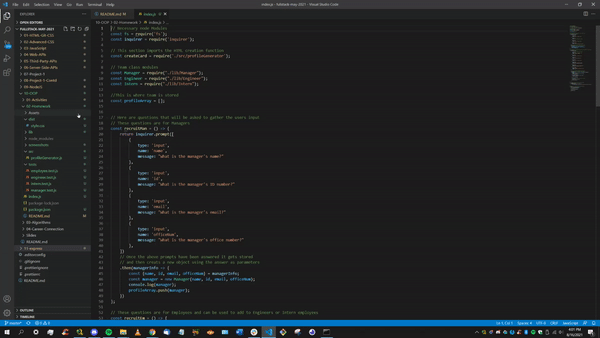
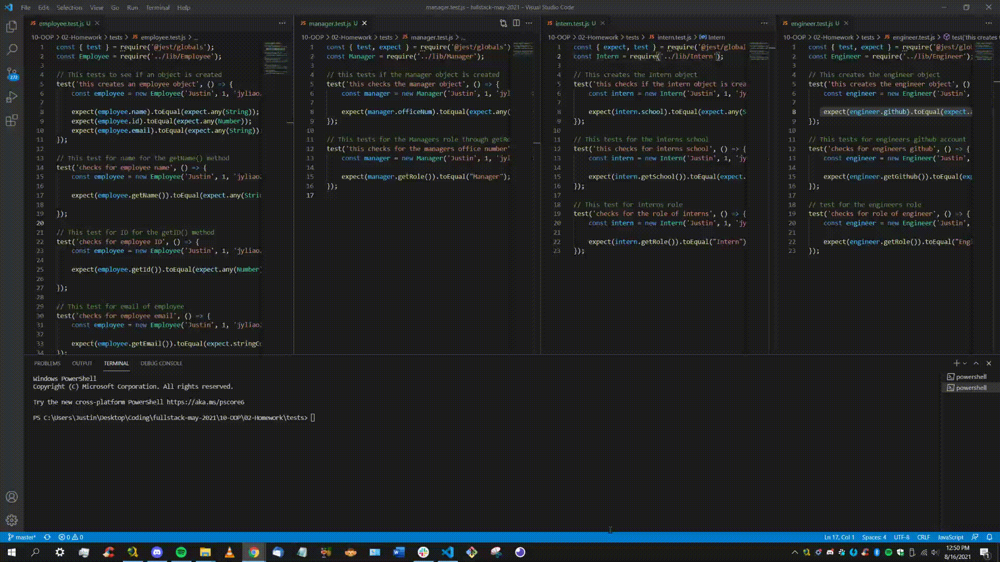
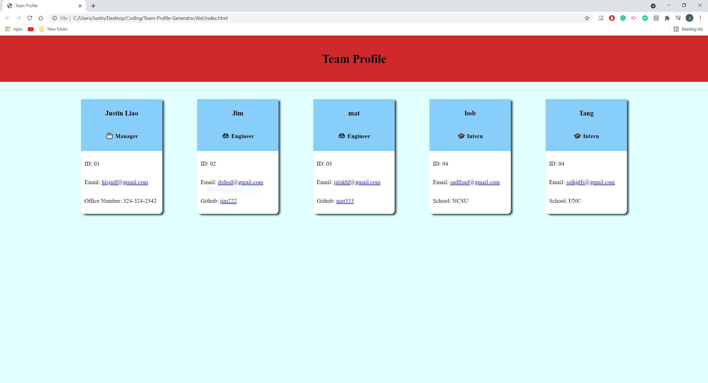
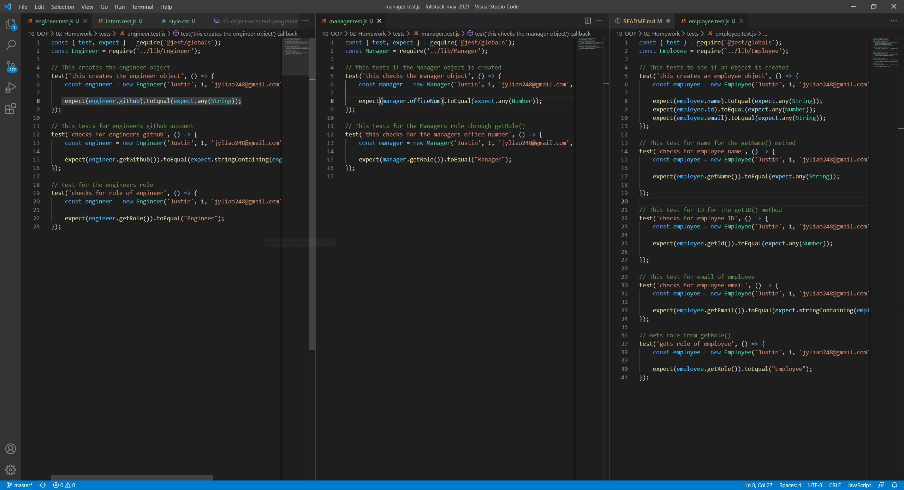
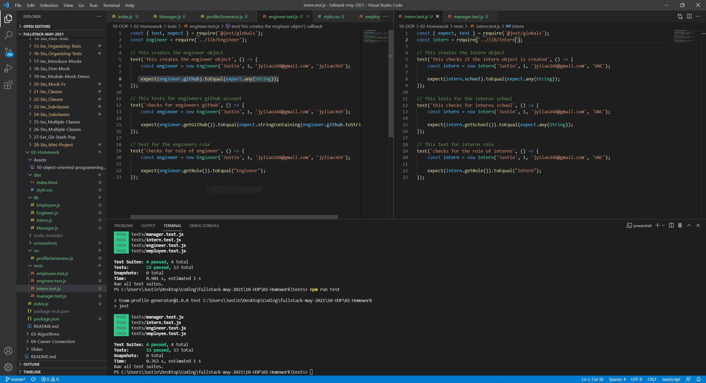
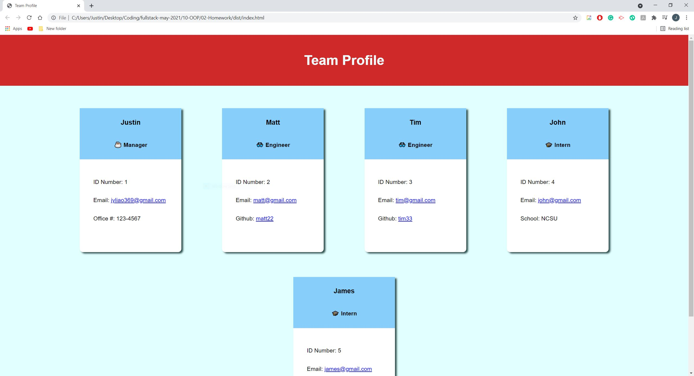

## Project Title: Team Profile Generator

  ## Description:
  The idea of this project is to create a application that displays the profile of all of the teammates working on a particular project. Once the team profile is created, individual cards are created and basic info on the individual is given such as the position or role they occupy, their ID number, their phone number, email, and github or school depening if the inddividual is a intern or an engineer. 

  ## Table of Contents
  * [Installation](#installation)
  * [Usage](#usage)
  * [Contributors](#contributors)
  * [License](#license)
  * [Tests](#tests)
  * [Questions](#questions)
  
  ## Installation
  -- What technologies did the application require in order to run smoothly and effectively?--

  The application uses Javascript, node and other NPM techonologies such as inquirer and express.

  ## Usage
  -- What is the application used for? --

  This application can be used by any manager or team management individuals as it allows the individual to type in and log basic details about a team and have it displayed on a team webpage. In addition to showing basic information, emails and githubs can be accessed when clicked on the team member's card profile.

  ## License
  -- Are there any license the application has? --

  This Application is covered by the MIT license.

  [License Information](https://opensource.org/licenses/MIT)

  

  ## Contributors
  -- Were there any contributors to the application/project --

  Contributors: Justin Liao

  ## Tests
  -- How can we test the application --

 The application can be tested through both VS code terminal and through the command line through gitbash. Once the application is ran through the node index.js, prompts will be given to fill in the information on each individual member starting with the manager and so on.

  ## Questions
  -- Have any questions? --

  Please reach out to me if you have any questions. Contact me at: jyliao369@gmail.com

  -- Want to see the repo of the project --

  Interested in seeing other projects I have worked on? My repository can be accessed here: 
  https://github.com/jyliao369

  ## Demonstration
  -- Demonstration of the application in VS Code --
  
  
  
  
  -- Demonstration of Class Testing --
  
  

  ## Screenshots
  -- Basic style of the application --
  

  -- Class Test --
  

  -- Successful Tests of Each Classes --
  

  -- Final Application --
  

  ## Live Links

  Github Repo: https://github.com/jyliao369/Team-Profile-Generator
